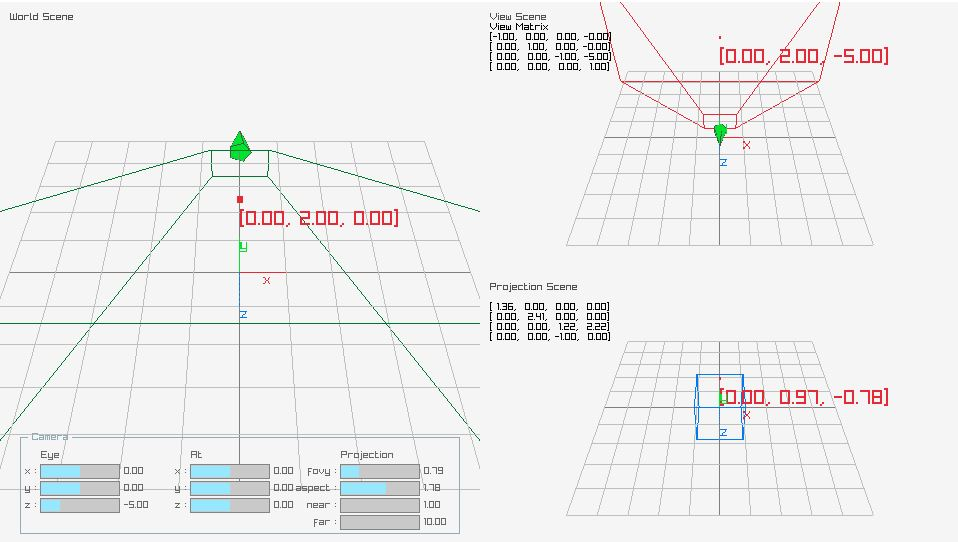

# mvp_transform_visualize
Understanding MVP(Model, View, Projection) transformation for 3D computer graphics by visual application.



- Right Click+Drag to rotate the camera
- Wheel to zoom in/out

## Compilation

Use CMake:
- Windows:
```
mkdir build
cd build
cmake .. -G "Visual Studio 15"
# open the 'mvp_transform_visualize.sln" through Visual Studio and build
```

- Linux/MacOS (Not tested)

## Library

I used awesome [raylib](https://github.com/raysan5/raylib) and [raygui](https://github.com/raysan5/raygui).
Template Cmake configuration borrowed from [here, from SasLuca](https://github.com/SasLuca/raylib-cmake-template)
